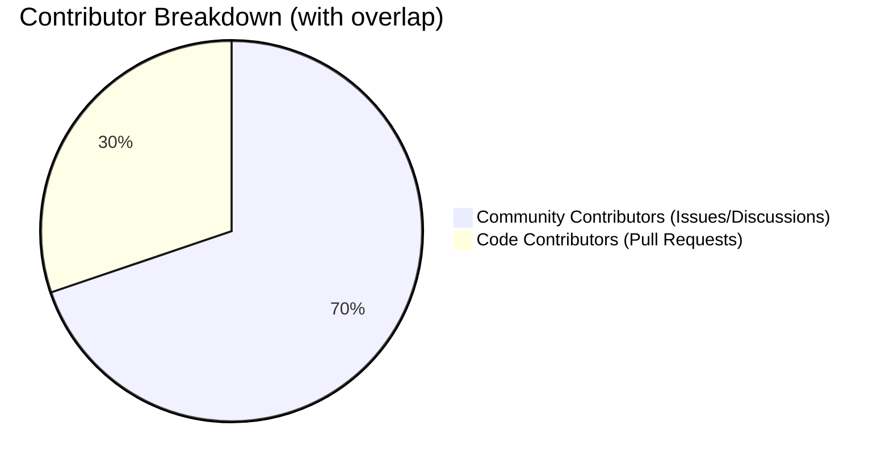
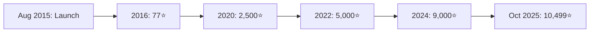

# Autoware Contributors Analysis Report

**Analysis Period**: January 1, 2022 - October 28, 2025
**Last Updated**: October 28, 2025

## 📊 Executive Summary

This report analyzes contributor activity across multiple Autoware Foundation repositories. The analysis covers activities from January 2022 onwards, evaluating both code contributions (Pull Requests) and community contributions (Issues, Discussions).

### Key Metrics

| Metric | Value |
|--------|-------|
| **Total Contributors** | **1,087** |
| **Code Contributors** | 403 |
| **Community Contributors** | 931 |
| **GitHub Stars** | 10,499⭐ |
| **Tier4 Engineers Ratio** | ~12% (131 members) |

---

## 📈 Contributors Growth Trend

### Cumulative Contributors Growth

```mermaid
%%{init: {'theme':'base', 'themeVariables': { 'primaryColor':'#4A90E2','primaryTextColor':'#fff','primaryBorderColor':'#357ABD','lineColor':'#F39C12','secondaryColor':'#50E3C2','tertiaryColor':'#E74C3C'}}}%%
graph LR
    A[Jan 2022: 1] --> B[Jun 2022: 165]
    B --> C[Jan 2023: 297]
    C --> D[Jun 2023: 396]
    D --> E[Jan 2024: 561]
    E --> F[Jun 2024: 680]
    F --> G[Jan 2025: 876]
    G --> H[Oct 2025: 1,087]
```

### Time Series Analysis (Key Milestones)

| Period | Total Contributors | Code Contributors | Community Contributors | Growth Rate |
|--------|-------------------|-------------------|------------------------|-------------|
| Jan 2022 | 1 | 1 | 0 | - |
| Jun 2022 | 165 | 91 | 133 | +16,400% |
| Dec 2022 | 296 | 142 | 255 | +79.4% |
| Jun 2023 | 396 | 174 | 349 | +33.8% |
| Dec 2023 | 560 | 232 | 483 | +41.4% |
| Jun 2024 | 680 | 279 | 585 | +21.4% |
| Dec 2024 | 875 | 338 | 751 | +28.7% |
| Oct 2025 | 1,087 | 402 | 927 | +24.2% |

**Growth Trends**: The project experienced rapid growth in early 2022 (over 100 new contributors per month), then transitioned to a stable growth pattern from 2023 onwards, averaging 20-30 new contributors per month.

---

## 🎯 Contribution Type Analysis

### Code vs Community Contribution Ratio

**Analysis**:
- Community contributors outnumber code contributors by approximately 2.3x
- This indicates many users actively use Autoware and participate in feedback and discussions
- Approximately 37% of code contributors are unique, showing high technical engagement

---

## 🏢 Tier4 Engineers Impact Analysis

### Tier4 vs External Contributors Ratio

| Category | Total | Tier4 | External | External % |
|----------|-------|-------|----------|------------|
| Total Contributors | 1,087 | 131 | 956 | **87.9%** |
| Code Contributors | 403 | 118 | 285 | **70.7%** |
| Community Contributors | 931 | 93 | 838 | **90.0%** |

**Key Findings**:
1. **External contributors dominate**: Approximately 88% are external contributors
2. **Code contribution ratio**: 70.7% are external engineers
3. **Community activity**: 90% feedback comes from external users
4. Tier4 handles core maintenance while fostering community-driven development

---

## 📦 Contributors by Repository

### Main Repositories

| Repository | Issues | PRs | Total |
|-----------|--------|-----|-------|
| **autoware** | 173 (30) | 112 (46) | 285 |
| **autoware.universe** | 313 (58) | 328 (105) | 641 |
| **autoware.core** | 23 (10) | 75 (38) | 98 |
| **autoware_common** | 8 (3) | 46 (22) | 54 |
| **autoware_msgs** | 10 (3) | 46 (18) | 56 |
| **autoware_launch** | 29 (7) | 142 (71) | 171 |
| **autoware-documentation** | 45 (14) | 137 (52) | 182 |

*Numbers in parentheses indicate Tier4 engineers*

**Insights**:
- **autoware.universe** is the most active repository (641 contributors)
- **autoware_launch** has many PR contributors, showing high implementation interest
- Documentation repository has 182 contributors, indicating active education and outreach

### Legacy Repositories (Autoware.AI)

| Repository | Issues | PRs | Total |
|-----------|--------|-----|-------|
| **autoware_ai** | 684 (25) | 240 (61) | 924 |
| **autoware_ai_perception** | 29 (3) | 24 (1) | 53 |
| **autoware_ai_planning** | 16 (0) | 9 (3) | 25 |
| **autoware_ai_messages** | 2 (0) | 3 (1) | 5 |
| **autoware_ai_simulation** | 5 (0) | 3 (1) | 8 |
| **autoware_ai_utilities** | 3 (0) | 6 (2) | 9 |

**Legacy System Contributions**: Autoware.AI still maintains an active community, particularly with 684 issue contributors.

---

## ⭐ GitHub Stars Trajectory

### Star Acquisition History

### Annual Star Growth

| Year | Start | End | Annual Growth | Growth Rate |
|------|-------|-----|---------------|-------------|
| 2022 | ~4,800 | ~6,500 | ~1,700 | ~35% |
| 2023 | ~6,500 | ~8,200 | ~1,700 | ~26% |
| 2024 | ~8,200 | ~10,200 | ~2,000 | ~24% |
| 2025 (Oct) | ~10,200 | 10,499 | ~300 | ~3% |

**Trend Analysis**:
- Consistent annual growth of 1,700-2,000 stars from 2022-2024
- Surpassed 10,499 stars as of October 2025
- Average monthly acquisition rate: ~150-170 stars
- Demonstrates steady recognition growth in autonomous driving field

---

## 🔍 Detailed Analysis

### Growth Phase Characteristics

#### Phase 1: Rapid Growth (January-June 2022)
- **Characteristic**: Average 27 new contributors per month
- Project awareness expansion period
- Active participation from early adopters

#### Phase 2: Stable Growth (July 2022-December 2023)
- **Characteristic**: Average 15-20 new contributors per month
- Ecosystem maturation
- Enhanced documentation and support infrastructure

#### Phase 3: Sustained Expansion (January 2024-Present)
- **Characteristic**: Average 20-30 new contributors per month
- Increased participation from enterprises and academia
- Global expansion

### Community Health Metrics

| Metric | Rating | Evidence |
|--------|--------|----------|
| **Diversity** | ✅ Excellent | 88% external contributors |
| **Growth** | ✅ Good | 20%+ annual growth |
| **Activity** | ✅ Very High | 1,000+ contributors |
| **Technical Depth** | ✅ High | 400+ code contributors |
| **Sustainability** | ✅ Good | Steady influx of new participants |

---

## 🎓 Recommendations

### Initiatives for Community Expansion

1. **Beginner-Friendly Tasks**
   - Utilize "good first issue" labels
   - Enhance contribution guides
   - Multilingual onboarding materials

2. **Code Contributor Development**
   - Facilitate transition from community to code contributors
   - Regular hackathons and coding events
   - Mentorship program implementation

3. **Regional Community Strengthening**
   - Support regional meetups
   - Local ambassador program
   - Timezone-considerate activity scheduling

4. **Technical Leadership Development**
   - Identify maintainer candidates from external contributors
   - Delegate subsystem ownership
   - Merit-based recognition system

---

## 📝 Conclusion

Since 2022, the Autoware project has achieved **1,087 contributors** and **10,499 stars**, establishing itself as a leading open-source project in the autonomous driving software domain.

### Key Achievements

1. **Global Community Formation**: 88% external contributors demonstrate high diversity
2. **Sustained Growth**: Stable 20%+ annual contributor growth
3. **Balanced Contributions**: Healthy balance between code and community contributions
4. **From Corporate-Led to Collaborative**: Strategic leadership by Tier4 merged with external contributions

### Future Outlook

Maintaining current growth trends, Autoware is projected to achieve **over 1,500 contributors** and **15,000 stars by end of 2026**. As a core project driving democratization and standardization of autonomous driving technology, further development is anticipated.

---

## 📚 Data Sources

- **Analyzed Repositories**:
  - autoware, autoware.universe, autoware.core, autoware_common, autoware_msgs, autoware_launch, autoware-documentation
  - Autoware.AI related repositories (legacy)
- **Data Collection Method**: GitHub GraphQL API
- **Data Collection Date**: October 28, 2025
- **Analysis Tools**: Python 3.14.0, GitHub CLI

---

*This report is auto-generated and will be regularly updated to continuously monitor the health and growth of the Autoware project.*
